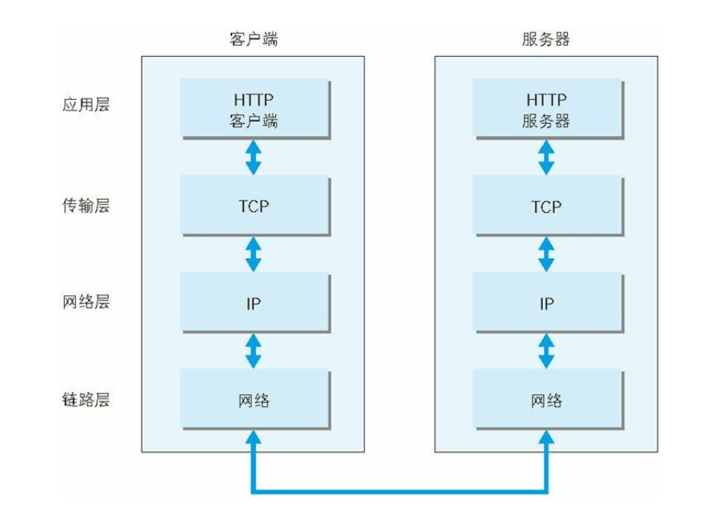
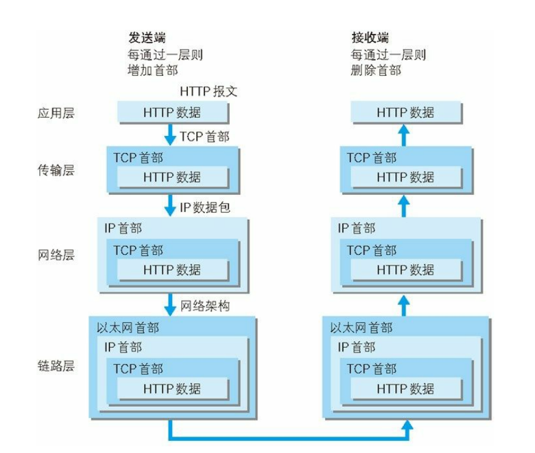
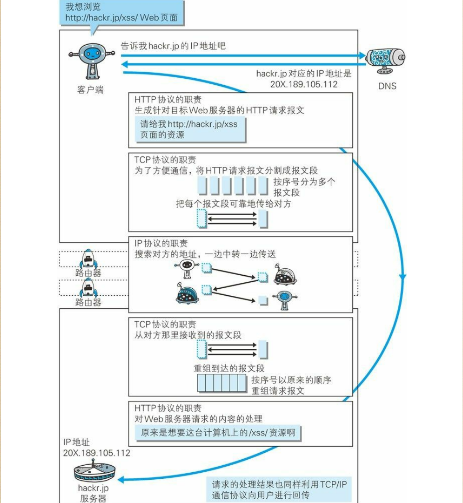

# 了解Web及网络基础

- WWW : 这一名称，是 Web 浏览器当年用来浏览超文本的客户端应用
程序时的名称。现在则用来表示这一系列的集合，也可简称为 Web。
- 网络基础 TCP/IP：我们通常使用的网络（包括互联网）都是基于TCP/IP协议上的。所以HTTP是它内部的一个子集。
  - 层级：应用层、传输层、网络层、链路层
  - 通信传输流图：
    
  - 发送和接收：
    
    发送端：由上直下，数据会经过层层的包裹，然后拆分成很多小报文包，然后发出。接收端：由下直上，数据会经过层层解包然后，将每个小报文组合成最终的数据。
  - 整个发送接收图解：
    
    