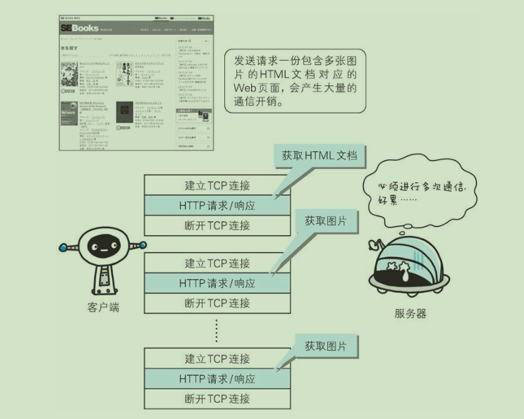
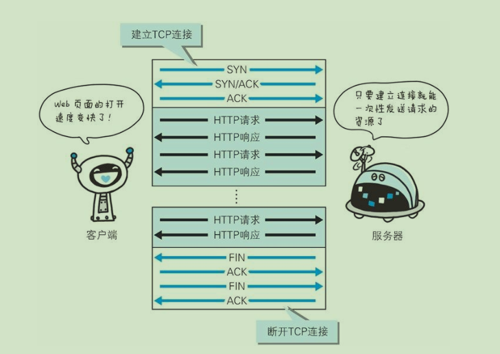
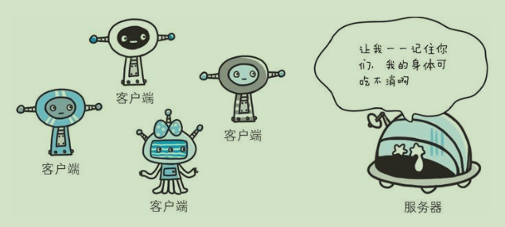
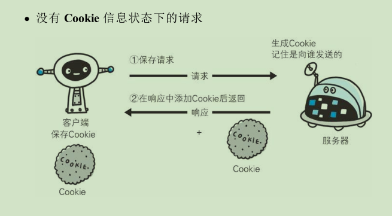
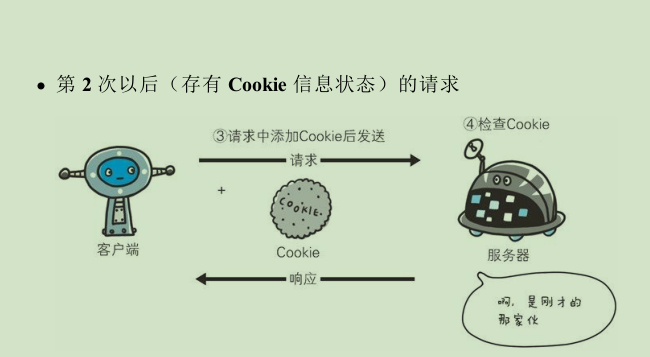

## HTTP协议是用于客户端和服务端之间的通信
- 请求访问文本或图像等资源的一端称作为客户端，而提供资源的一端称作为服务端。
- 在一条HTTP通信线路上，客户端和服务端是确定，必须有一端是客户端和有一端是服务端。实际情况中，客户端、服务端的角色可能会互换，但是从仅从一条通信线路上说，这两端是确定的。
- HTTP是不保存状态的协议HTTP协议自身不对请求和响应之间的通信状态进行保存。

## 简单的http协议

- 通信是从客户端开始建立的，客户端向服务端发送请求，服务端响应请求并且返回数据。那么就是**通过请求和响应的交换达成通信**。
- 客户端发送请求的例子：
  ``` 
    GET /index.html HTTP/1.1
    HOST: hackr.jp
  ```
  GET表示请求的方式、方法（method），/index.html表示请求指定资源，称为URI（request-URI），最后HTTP/1.1表示客户端使用的协议版本。

  请求报文是由*请求方法*、*请求 URI*、*协议版本*、*可选的请求首部字段*和*内容实体*构成的。
- 服务器响应的例子：
  ```
  HTTP/1.1 200 ok
  Date: Tue, 10 Jul 2012 06:50:15 GMT
  Content-Length: 363
  Content-Type: text/html

  <html>
  ...
  ```
  HTTP/1.1： 服务器的协议版本  
  200 ok： 响应的状态码和原因短语（简短的解释）  
  Date: Tue, 10 Jul 2012 06:50:15 GMT： 创建响应的时间  
  下面就是首部字段，然后空一行就是内容实体。

## 告知服务器意图的HTTP方法
- GET 获取资源
  
  GET方法用来请求已被已被URI识别（存在的）的资源。指定的资源经服务器解析后返回响应内容。
- POST 传输实体主体

  向服务器传输主体，POST的主要目的并不是获取响应的主体内容。

- PUT 传输文件

- HEAD 获取报文的首部

  与GET类似，只是响应不会返回报文主体部分，只有头部。

- DELETE 删除文件

- OPTIONS 询问支持的方法

  用来查询针对请求URI指定的资源支持的方法。
  比如：
  ```
  // 请求
  OPTIONS * HTTP/1.1
  Host: www.hackr.jp
  // 响应
  HTTP/1.1 200 OK
  Allow: GET,POST,HEAD,OPTIONS
  ```
- TRACE 追踪路径

  客户端通过TRACE方法可以查询发出去的请求是怎么被加工修改、篡改的。一个请求想要连接到原目标服务器可能通过代理中转，TRACE方法就是用来确认连接过程中发生的一系列的操作。**但是TRACE方法本来不怎么常用，在加上它容易引发XST（Cross-Site Tracing，跨站追踪）攻击，通常就更不会使用了**

- CONNECT 要求用隧道协议连接代理

  要求在与代理服务器通信时建立隧道，实现用隧道协议进行TCP通信。主要使用SSL（Secure Sockets Layer，安全套装层）和TSL（Transport Layer Security，传输层安全）协议把通信内容加密后经网络隧道传输。

## 持久连接节省通信量

> HTTP初期的版本中，每进行一次通信就要断开一次TCP连接，以当年通信情况来说，因为都是容量小的文本传输，所以即使这样也没有什么问题，但是现在来看，文档中包含大量的图片是很平常的需求，所以这种通信一次就断掉的方法就不可取了。



- 为解决以上TCP通信问题，HTTP/1.1和一部分HTTP/1.0想出了持久连接（HTTP Persistent Connections，也称为**HTTP keep-alive**或HTTP connection reuse）的方法。持久连接的特点是，只要任意一方没有提出明确的断开连接，则保持TCP连接状态。



> 在HTTP/1.1中，所有的默认连接都是持久连接，在HHTP/1.0中并没有标准化。客户端和服务端需要同时支持持久化才行。

## 使用Cookie的状态管理

- HTTP是无状态协议，它不对之前发生过的请求和响应的状态进行管理。也正是因为这一特性，自然可以减少服务器的CPU及内存资源的消耗。从另一侧面来说，也正是HTTP协议本事是非常简单的，所以才会被应用在各种场景中。

- 需要记录状态的场景：假设要求登录认证的Web页面本身无法进行状态管理（不记录的状态），那么每次跳转新页面就要再次登录，或者要在每次请求报文中附加参数来管理登录状态。

  

- 在保留无状态这个特性的同是又要解决类似的矛盾问题，于是引入了Cookie技术。Cookie是通过在**请求和响应报文中写入Cookie**信息来控制客户端的状态。

- **Cookie 会根据从服务端发送的响应报文内的一个叫做Set-Cookie的首部字段信息，通知客户端保存Cookie。当下次客户端再往该服务器发送请求时，客户端会自动在请求报文中加入Cookie值后发送出去。服务器端发现客户端发过来的请求中包含Cookie信息，拿着Cookie信息去服务器上的记录对比，来确定是哪一个客户端，做相应的操作。**

- 


  相应的头部：

  1.请求报文（没有Cookie信息状态）
  ```
  GET /reader/ HTTP/1.1
  Host: hackr.jp
  * 首部字段没有cookie的相关信息
  ```
  2.响应报文（服务器生成Cookie信息）
  ```
  HTTP/1.1 200 OK
  Date: Thu, 12 Jul 2012 07:12:20 GMT
  Server: Apache
  <Set-Cookie: sid=1123423543234325; path=/; expires=Wed,10-Oct-12 07:12:20 GMT>
  Content-Type: text/plain; charset=UTF-8
  ```
  3. 请求报文（自动发送保存着Cookie信息）
  ```
  GET /image/ HTTP/1.1
  Host: hackr.jp
  Cookie: sid=1123423543234325
  ```


