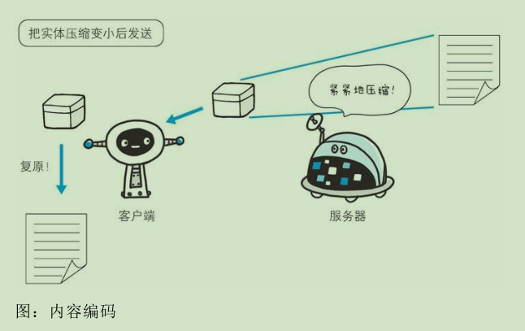
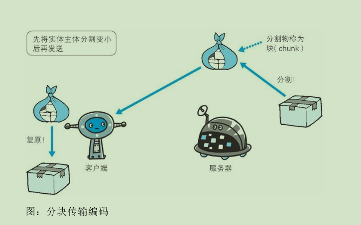
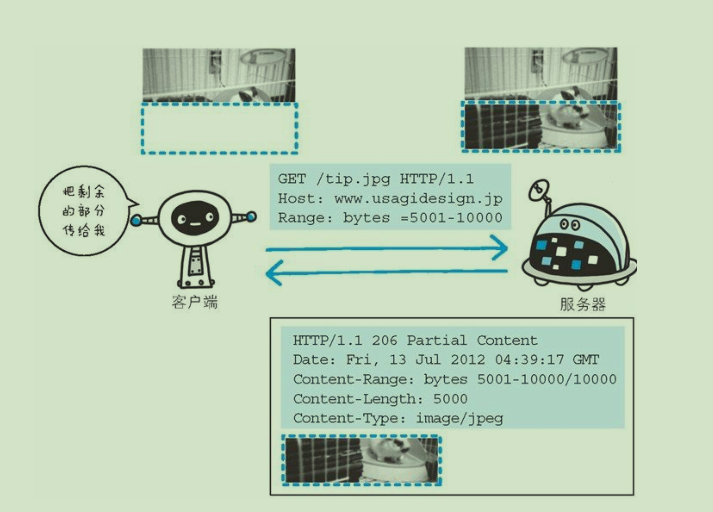

# HTTP报文内的HTTP信息

### HTTP报文

- 用于HTTP协议交互的信息被称作为HTTP报文。请求端和服务端分别被叫做请求报文和响应报文。HTTP报文由**报文首部和报文主体**组成，首部和主体之间由【CR+LF】换行分割，一个HTTP报文不一定需要报文主体。

- 请求报文首部：请求行、请求首部字段、通用首部字段、实体首部字段、其他。
- 响应报文首部：状态行、响应首部字段、通用首部字段、实体首部字段、其他。

- 请求报文：
  ```
  GET / HTTP/1.1  --请求行
  Host:www.baidu.com
  User-Agent:Mozilla/5.0 (Windows NT 10.0; Win64; x64) AppleWebKit/537.36 (KHTML, like Gecko) Chrome/61.0.3163.100 Safari/537.36
  Accept:text/html,application/xhtml+xml,application/xml;q=0.9,image/webp,image/apng,*/*;q=0.8
  Accept-Language:zh-CN,zh;q=0.8,en;q=0.6
  Accept-Encoding:gzip, deflate, br
  Upgrade-Insecure-Requests:1
  Cache-Control:max-age=0
  Connection:keep-alive                --各种首部字段
  (CR-LF) --空行
  ```
- 响应报文：
  ```
  HTTP/1.1 200 OK -- 状态行
  Bdpagetype:2
  Bdqid:0xb377d200000097b1
  Bduserid:1270621848
  Cache-Control:private
  Connection:Keep-Alive
  Content-Encoding:gzip
  Content-Type:text/html;charset=utf-8
  Date:Wed, 18 Oct 2017 05:57:28 GMT
  Expires:Wed, 18 Oct 2017 05:57:28 GMT
  Server:BWS/1.1
  Set-Cookie:BDSVRTM=187; path=/
  Set-Cookie:BD_HOME=1; path=/
  Set-Cookie:H_PS_PSSID=1450_21119_20929; path=/; domain=.baidu.com
  Strict-Transport-Security:max-age=172800
  Transfer-Encoding:chunked
  X-Ua-Compatible:IE=Edge,chrome=1    -- 各种首部字段
  (CR-LF) -- 空行
  <!Doctype html>
  <html xmlns=http://www.w3.org/1999/xhtml>
  <head>
  ...                                 -- 响应主体
  ```

- 请求报文和响应报文的首部内容由以下数据组成：
  
  - 请求行： 包含用于请求的方法，请求的URI和HTTP版本
  - 状态行： 包含表面阐述响应结果的状态码，原因短语和HTTP版本
  - 首部字段：包含表示请求和响应结果的各种条件和属性的各类首部。一般有4中首部，分别是：通用首部、请求首部、响应首部、实体首部。
  - 其他： 可能包含HTTP的RFC里没有定义的首部（Cookie等）。

- 编码提升传输效率
  
  通过在传输时编码，能有效地处理大量的访问请求。但是，编码的操作需要计算机来完成，因此会消耗更多的CPU等资源。

  - 报文主体和实体主体的差异

    - 报文
      
      是HTTP通信中的基本你单位，由8位字节流组成，通过HTTP通信传输。

    - 实体

      作为请求或响应的有效载荷数据被传输，其内容由实体首部和实体主体组成。
    
    HTTP报文的主体用于传输请求或响应的实体主体。

    通常，报文主体等于实体主体，只有在传输中进行编码操作，实体主体的内容会发生变化，才导致它和报文主体产生差异。
  
- 压缩传输的内容编码

  HTTP协议中有一种被称为**内容编码**的功能也能进行类型的操作，内容编码指明应用在实体内容上的编码格式，并保持实体信息原样压缩。内容编码后的实体由客户端接收并负责解码。

  

  常用的内容编码有以下几种

  - gzip（GNU zip）
  - compress （UNIX 系统的标准压缩）
  - deflate （zlib）
  - identity （不进行编码）

- 分割发送的分块传输编码

  

  在HTTP通信过程中，请求的编码实体在没有全部传输完成之前，浏览器是无法显示请求页面的。所以在传输大量数据时，通常会把数据分割成多块。将这种技术称为 分块传输编码。

  使用分块传输编码的实体主体会由接收的客户端负责解码，恢复到编码前的实体主体。

- 发送多种数据的多部分对象集合

  发送邮件时，我们可以在邮件里写入文字并添加多发附件。这是因为采用了MIME（Multipurpose Internet Mail Extensions，多用途因特网邮件扩展）机制，它允许邮件处理文本、图片、视频等多个不同类型的数据。

  HTTP协议中也采纳了多部分对象集合，发送的一份报文主体内可含多类型实体。通常是在图片或文本文件等上传时使用。

  多部分对象集合包含的对象如下：
  
    - multipart/form-data
      
      在Web表单文件上传使用
    
    - multipart/byteranges

      状态码206响应报文包含了多个范围的内容时使用。
    
    - multipart/form-data
      ```
      Content-Type: multipart/form-data; boundary=AaB03x
      --AaB03x
      Content-Disposition: form-data; name="field1"
      Joe Blow
      --AaB03x
      Content-Disposition: form-data; name="pics"; filename="file1.txt"
      Content-Type: text/plain
      ...（file1.txt的数据）...
      --AaB03x--
      ```

    - multipart/byteranges
      ```
      HTTP/1.1 206 Partial Content
      Date: Fri, 13 Jul 2012 02:45:26 GMT
      Last-Modified: Fri, 31 Aug 2007 02:02:20 GMT
      Content-Type: multipart/byteranges; boundary=THIS_STRING_SEPARATES
      --THIS_STRING_SEPARATES
      Content-Type: application/pdf
      Content-Range: bytes 500-999/8000
      ...（范围指定的数据）...
      --THIS_STRING_SEPARATES
      Content-Type: application/pdf
      Content-Range: bytes 7000-7999/8000
      ...（范围指定的数据）...
      --THIS_STRING_SEPARATES--
      ```

- 获取部分内容的范围请求

  以前的用户带宽不够，下载一个尺寸稍大的图片或者文件就会很吃力。如果下载过程中遇到网络问题中断了下载，那么就需要从头开始。为了解决上述问题，就产生了一种叫范围请求的功能。

  对于一份10000字节大小的资源，如果使用范围请求，可以只请求5001~10000字节内的资源。

  

  执行范围请求时，会用到首部字段Range来指定资源的byte范围：

  ```
  Range: bytes=5001-10000 // 5001-10000字节之间
  ```

  ```
  Range: bytes=5001- // 从5001字节之后全部
  ```

  ```
  Range: bytes=1-3000,5000-10000 // 多范围指定
  ```

  **针对范围请求，响应会返回206状态码。对于多重范围请求，响应会在首部字段Content-Type表明multipart/byteranges后返回响应报文**

  如果服务端无法响应范围请求，则会返回状态码200 OK然后返回完整的实体内容。
