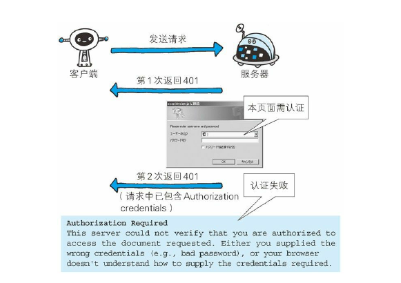
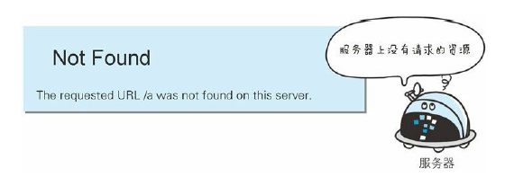

# 返回结果的HTTP状态码

> HTTP状态码负责表示客户端HTTP请求的返回结果、标记服务器端的处理是否正常、通知出现的错误等工作。我们可以通过返回的状态码来判断请求是成功或者失败。

### 状态码类型
状态码 | 类别 | 原因短语
:---  |:---  |:----
1XX| Information（信息性状态码）|接收的请求正在处理
2XX|Success（成功状态码）|请求正常处理完毕
3XX|Redirection（重定向状态码）|需要进行附加的操作以完成请求
4XX|Client Error（客户端错误状态码）|服务器无法处理请求
5XX|Server Error（服务端错误状态码）|服务器处理请求出错

### 2XX 成功
  * 200 OK 表示从客户端发来的请求在服务端被正常处理了。
  

  * 204 No COntent 表示客户端请求成功但是服务器返回的内容**没有实体的主体内容**，也表示不能够返回实体的主体。场景：用在客户端像服务端发送内容，而客户端自己不需要做更新。
  

  * 206 Partial Content 该状态码表示客户端进行了范围请求并且服务器c成功的执行了该GET请求。此时响应报文里面应该包含Content-Range字段来表示范围。
  

### 3XX 重定向
  * 301 Moved Permanently 永久重定向。该状态码表示当前请求的资源已经被分配了新的URL，以后使用的话，应该访问新的URL。
  

  * 302 Found 临时重定向。表名称当前请求的资源已经被分配了新的URL，希望客户端（本次）使用新的URL来访问。
  

  * 303 See Other 该状态码表示由于请求对应的资源存在着另一个URL，应该使用GET方法定向获取请求的资源。303 状态码和 302 Found 状态码有着相同的功能，但 303 状态码明确表示客户端应当采用 **GET** 方法获取资源，这点与 302 状态码有区别。
  
    > 当 301、302、303 响应状态码返回时，几乎所有的浏览器都会把
    POST 改成 GET，并删除请求报文内的主体，之后请求会自动再次
    发送。
    301、302 标准是禁止将 POST 方法改变成 GET 方法的，但实际使
    用时大家都会这么做。
  
  * 304 Not Modified 该状态表示客户端发送附加条件的请求，而此时服务允许了请求，但是不满足条件,才返回该状态码，如果满足就返回200。
    > 附加条件一般指的是：GET方法中请求报文中包含If-Mathc、If-Modified-Since、If-Not-Match等,其中的任一请求首部。
  

### 4XX 客户端错误
  * 400 Bad Request 该状态码表明，客户端的请求报文中存在语法错误。当错误发生时，客户端需要重新修改请求内容后，重新发送请求。
  

  * 401 Unauthorized 该状态码表示发送的请求需要通过HTTP认证(BASIC认证、DIGEST认证)。另外，如果用户已经进行过一次请求，那么返回401则表示认证失败。
  

  * 403 Forbidden 该状态码表明客户端请求被服务端拒绝。此时服务端没有必要对拒绝的原因进行说明，但是如果需要给出，那么就可以在响应实体中加入说明，返回给客户端。
    > 未获得文件系统的访问授权，访问权限出现某些问题（从未授权的发
    送源 IP 地址试图访问）等列举的情况都可能是发生 403 的原因。
  

  * 404 Not Found 该状态表明服务器上无法定位请求的资源。另外，也可以在服务器拒绝客户端请求但不想说明理由的时候返回该状态码。
  

### 5XX 服务器错误
  * 500 Internal Server Error 该状态表明，服务器在处理请求的时候，服务端内部发生了错误。也可能是web应用存在着bug或者临时障碍。
  

  * 503 Service Unavailable 该状态表明，服务器正处于超负载和停机维护中,现在无法处理请求。
  

> 状态码和状况的不一致
不少返回的状态码响应都是错误的，但是用户可能察觉不到这点。
比如 Web 应用程序内部发生错误，状态码依然返回 200 OK，这种
情况也经常遇到。

  
