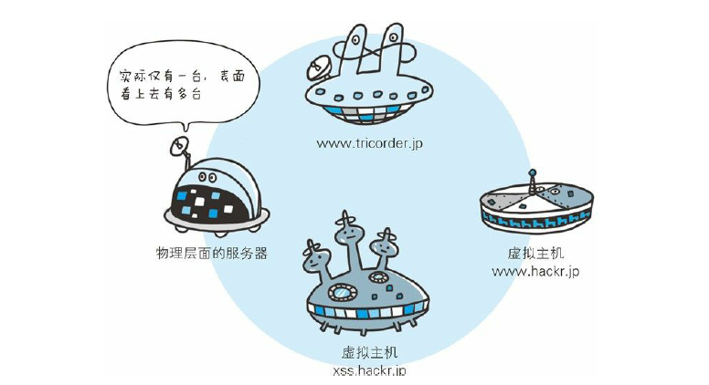
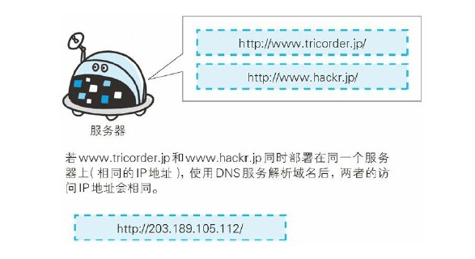

# 与 HTTP 协作的 Web 服务器
> 一台web服务器可以d搭建多个独立域名的web网站，也可以作为t通信路径上的中转服务器t提高传输效率。

## 用单台虚拟主机实现多个域名

客户端使用http协议访问服务器时候，会经常采用类似www.zachrey.com这样的域名或者主机名。

在访问过程中，域名通过DNS服务映射到IP地址后（DNS解析）再访问目标网站。可以，在访问服务器时，已经是以IP地址的形式了。

**如果一个服务器内托管了两个域名'www.zhang.com'和'www.zachrey.com'，那么此时服务器接收到请求的时候就需要弄清应该去访问哪个域名（服务）。**

在相同的IP地址下，虚拟主机可以寄存多个不同的域名和主机名的网站。因此在发送HTTP请求时，**必须在HOST首部内指定完整的主机名或者域名的URI**。

## 通信数据转发程序 ：代理、网关、隧道

